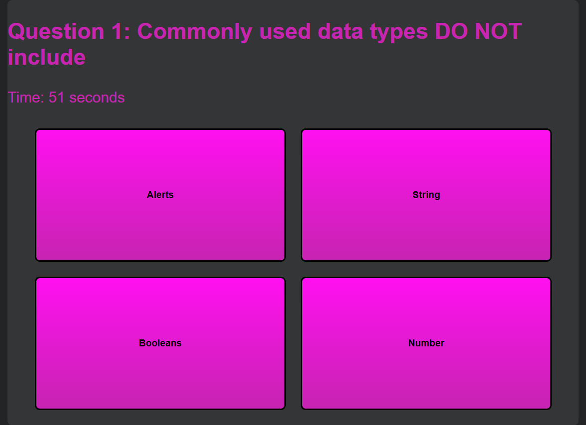

# Code-Quiz

## Table of Contents
1. [Description](#description)
2. [Visuals](#visuals)

## Description
This project is supposed to be a coding quiz game, you hit the start button on the start screen which then transfers to another screen that has a question and 4 answers and a timer that starts to count down every second. When the timer hits 0 it then shows the highscore screen which you can add your initials and then it saves to the local storage.

[Link to Live Site](https://revilite.github.io/Code-Quiz/)

## Visuals

